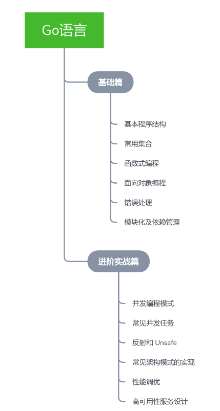
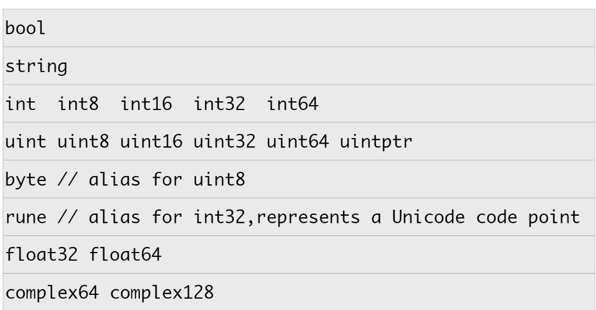
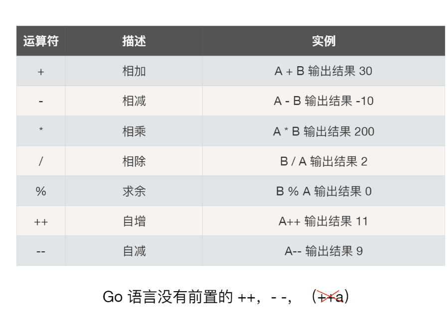
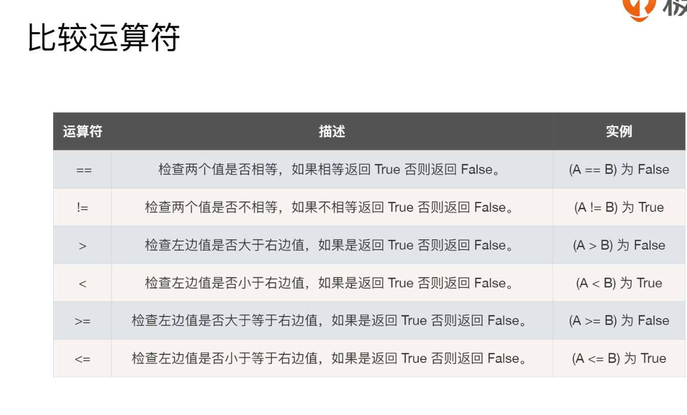
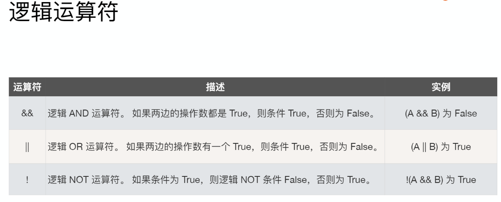
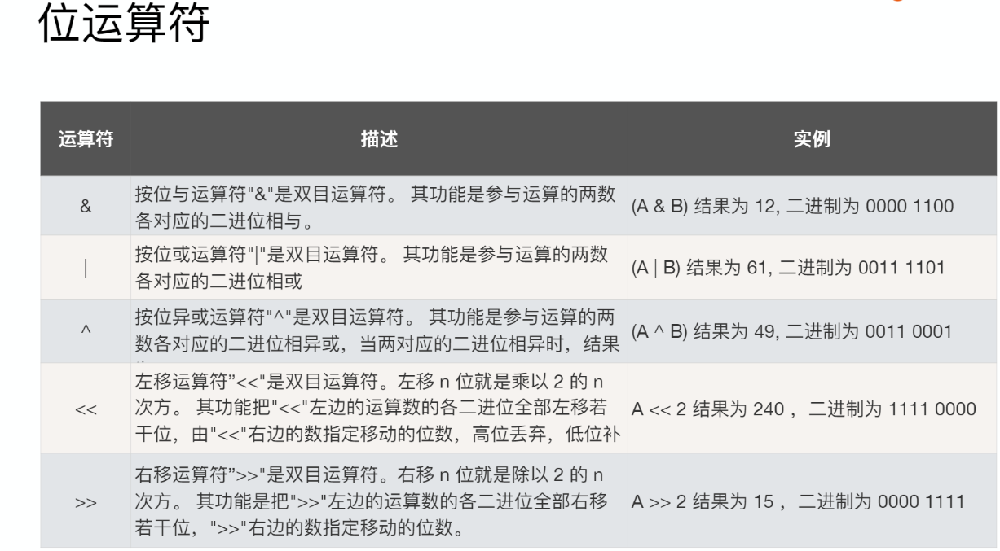
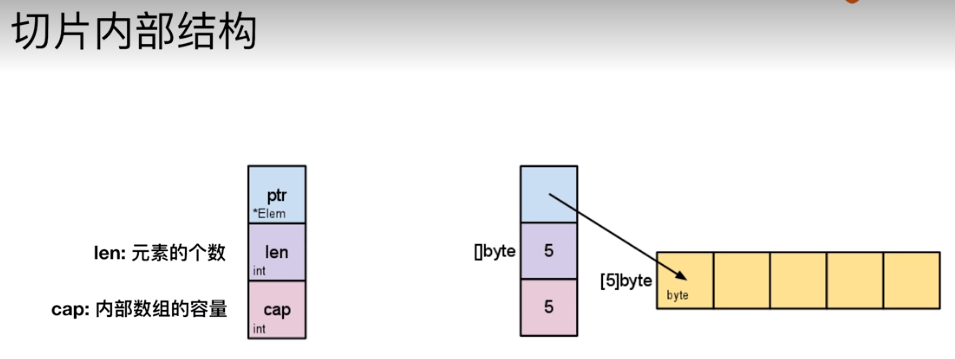

# learnGO

### 背景和发展
- 多核硬件架构
- 超大规模分布式计算集群
- Web 模式导致的前所未有的开发规模和更新速度

### 特点
- 简单
Go只有25个关键字；特别是对于一些复杂编程任务如：并发编程，内存管理，Go语言有内置的并发支持及GC
- 高效
Go是编译的静态类型语言，并且可以通过指针进行直接内存访问
- 生产力
简单清新的依赖管理，简单清新的语法，以及独特的接口类型

### 开发环境构建
`go version`
GOPATH在1.8版本前必须设置这个环境变量,1.8版本后（含 1.8）如果没有设置使用默认值,在Unix上默认为$HOME/go, 在Windows上默认为%USERPROFILE%/go

### hello world
`go run xxxxxxxxxxx`

`go build xxxxxxxxxxx`
- 必须是main包`package main`
- 必须是main方法`func main()`
- 文件名不一定是main.go
- Go中main不支持任何返回值，通过os.Exit返回
- main中不支持传入参数，通过os.Args获取

### 编写测试程序
- _test结尾`xxx_test.go`
- Test方法名开头`func TestXXX(t *testing.T){...}`
- `go test -v xxx_test.go 才能输出t.Log里的文字`

### 变量赋值
- 赋值可以进行自动类型推断
- 在一个赋值语句中可以对多个变量进行同时赋值

### 快速设置常量连续值

### 数据类型

- Go不允许隐式类型转换
- 别名和原有类型也不能进行隐式类型转换

#### 类型预定义值
1. math.MaxInt64
2. math.MaxFloat64
3. math.MaxUnit32

#### 指针类型
1. 不支持指针运算
2. string是值类型 默认为空串而不是nil

### 运算符

#### 用==比较数组
- 相同维度且含有相同个数元素的数组才可以比较
- 每个元素都相同的才相等

#### &^按位置零
1 &^ 0 --1

1 &^ 1 --0

0 &^ 1 --0

0 &^ 0 --0

### 条件和循环
- Go仅支持for
- if条件
  - condition表达式结果必须为布尔值
  - 支持变量赋值
- switch
  - 条件表达式不限制为常数或整数
  - 单个case中可出现多个结果选项，逗号分隔
  - 不需要break
  - 可以不设定swich之后的条件表达式，此种情况与多个if..else等同

### array
### slice

### array vs slice
- 容量是否可伸缩
- 是否可比较

### Map
- 在访问Key不存在时，仍会返回零值，不能通过返回nil来判断元素知否存在
- value可以是方法
- 与Go的Dock type接口方式一起，可以实现单一方法对象的工厂模式
- Go没有Set,可以map[type]bool

### 字符串

### 函数是一等公民
- 可以返回多个值
- 所有参数都是值传递
- 函数可以做变量值
- 函数可以作为参数和返回值

